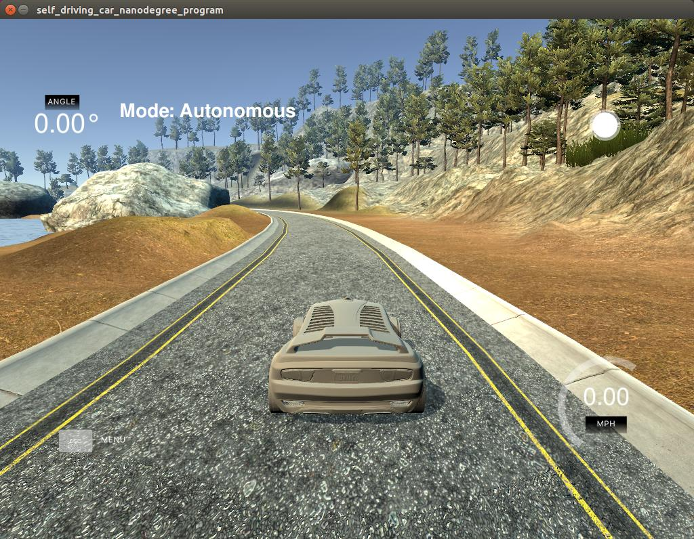
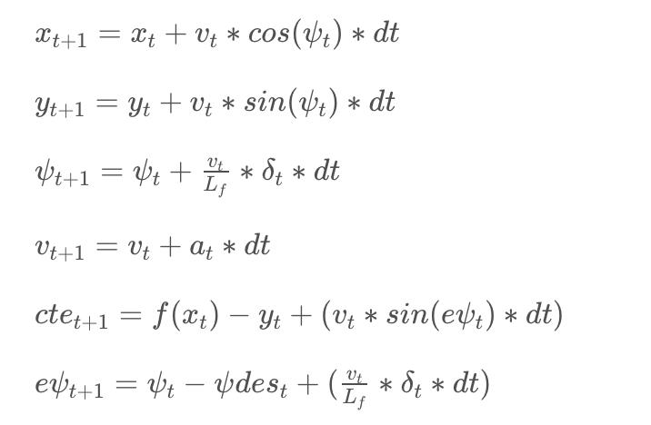

# CarND-Controls-MPC
Self-Driving Car Engineer Nanodegree Program

---

## Intro
This project implements a MPC Controller. A simulator is provided by Udacity ([it could be downloaded here](https://github.com/udacity/self-driving-car-sim/releases)). This simulator will generate (ptsx) - global x positions of the waypoints, (ptsy) - global y positions of the waypoints, (psi) - orientation of the vehicle, speed, x and y position of the vehicle using [WebSocket](https://en.wikipedia.org/wiki/WebSocket). The solution must be robust to 100ms latency, as one may encounter in real-world application. Udacity provides a seed project to start from on this project [here](https://github.com/udacity/CarND-MPC-Project).

This project involves the Term 2 Simulator which can be downloaded [here](https://github.com/udacity/self-driving-car-sim/releases)

## How to compile and run: 

    Perform steps following:

    - Clone this repos
    - Make build directory: **mkdir build && cd build**
    - Compile the code: **cmake .. && make**
    - Run the code: **./mpc **
    - Start and run Project 5 : MPC Controller of Self Driving Car Simulator

## Result

## Vehicle Kinematic Model

The Kinematic model includes the vehicle x and y positions, orientation angle (psi), vehicle velocity, cross-track error (CTE) and error in orientation of vehicle compared to reference trajectory (epsi). Actuator outputs are acceleation and steering angle. Using the model to predict the future state and actuation of the vehicle.

## Timestep Length and Elapsed Duration (N & dt)
The final value chosen for N and dt are 10 and 0.1. The default latency set as 100ms. The dt is set as 0.1s. The model will predicts the next 10 states of the vehicle. As the N increases, the vehicle will start to oscillate badly. It seem like the ipopt solver unable to produce optimal results in less than 0.05 seconds.
